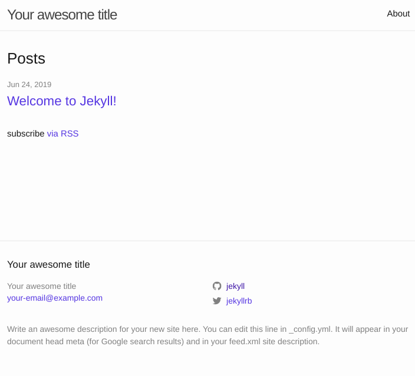

# 3. Start a new project

To start a new project, first we need to create it.

```bash
jekyll new myblog
# Where "myblog" is the name of your project.
```

Now we can go inside the project and build it with a default configuration and make it available on local.

```bash
cd myblog && bundle exec jekyll serve
```

There we can browse to  [localhost:4000](http://localhost:4000)

You should see your website



## Next step: [4. Plugins](4_plugins.md)
