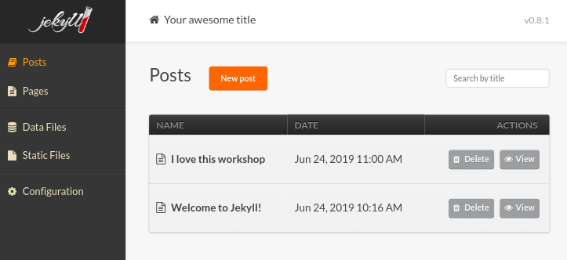
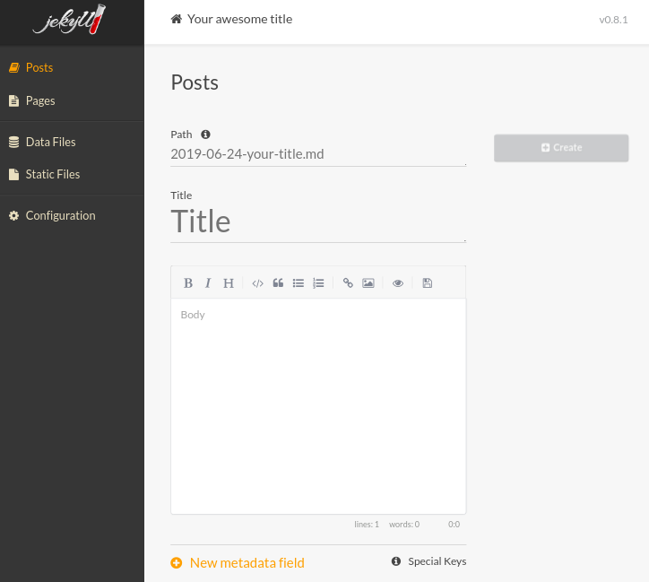
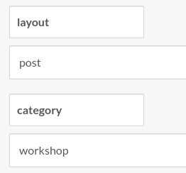

# 6. Make some actions on your site

Let's play around a litte bit.

## Build your website

If it's not yet build

```bash
    jekyll serve
```

## Add some posts

Take a look to the `_posts` folder. There is a file that should look like that `2019-06-25-welcome-to-jekyll.markdown`. This is a post, a news, an entry to your blog.
By default, Jekyll will show them on your homepage by date order.
For now, we'll just learn to make a new entry.

Open your favorite text/code editor and create a new file `2019-06-25-workshop.md`

Jekyll use something call **YAML Frontmatter**. It's some lines you have to put at the start of your file to let it know how it must handle the page.

#### Put these lines

```yml
---
layout: post
title:  "I love this workshop"
date:   2019-06-25 09:00:00 +0200
categories: workshop
---
```

### What it does?

**layout**: tell Jekyll which layout it should use to display this page. More on that later.

**title**: really?

**date**: come on, it's just a date! :exclamation: Carefull with the format, It need to be: yyyy-mm-dd hh:mm:ss +/-TTTT. You can't "program" a article to appear in a future date. If you put a date in the future, you'll still need to rebuild your site for your article to appear.

**category**: here you can put some categories to organize your entries. It's optionnal. More on that later.

Now that we tell Jekyll how to display this page, let's add some content. Everything should be done in markdown.

```markdown
Add what you want here: text, images, links, title,...
```

Need a refreshner on markdown? [Here your are](https://github.com/adam-p/markdown-here/wiki/Markdown-Cheatsheet)

## Add some posts with Jekyll-admin

Now that you saw how Jekyll work, let's use Jekyll-admin to do exactly the same but without your favortie editor. :cry:

Go to [http://localhost:4000/admin](http://localhost:4000/admin)

You should already see two posts in the posts section. The one by default and the one we just created.
Now let's add a new one. Click on that orange button "New Post". 



In here we see a few fields to fill.



### What are these fields?

**path**: it's the name of your file. You can leave it blank and it will be auto-generate.

**title**: bah, it's the title of your post!

**body**: here you can put some markdown, you'll have some icons to help you give it some style.

**metafields**: you remember that Frontmatter, with layout, title,... It's here you can specify them. 

### Metafields

Let's see how this works. For now, we've already specify the title, but we're mising "layout" and "category" from our previous file.

Let's click "Add metafield" and add these.



Save it. Now if you're oppenning your file in your editor, you should see that the Frontmatter has been add.

```yml
---
layout: post
category: workshop
title: Admin
---
```

We're still missing the date, BUT, Jekyll have put it in the path file, so it's correct, but it only use the day, not the hour. If you need to put more posts on the same day, it could be a bit tricky to show them in the correct order. If you need to override the date, you can specify a metafield "date" and put it exactly like in the Frontmatter we did earlier. When you do that, Jekyll-admin add two buttons to select more easily a date and hour.

## Add a page

Pages works exactly like post, but they have another purpose. Being some content that don't need to look like a news. More like a team page or a contact one.

To add one, you can add a file to the root folder or do it with Jekyll-admin

The most important thing to never forget when creating a file in Jekyll-admin or by yourself, is to put the layout.

```yml
---
layout: page
---
```

If you forget it, you're page will be with no style. Just a blank sheet with some text on it... We don't want that. Ok, for now with this theme is pretty much the same, but at least with have some "structure".

### Want to do more?

Jekyll is really powerfull, but I won't be able to cover everthing. If you like it, you'll have to do some research for yourself. But I have a few exercices for you to do, to manipulate Jekyll a bit more.

## Next step: [Let's do some work on it](7_work.md)
